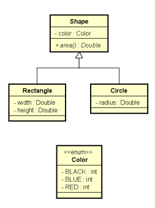

## Exercicio-POO-1


### **Exercicio 1:**
Faça um programa para ler a cotação do dólar, e depois leia o valor em dólares a ser comprado. A saída será quantos reais a pessoa pagará pelos dólares, considerando ainda que a pessoa pagará 6% de IOF sobre o valor em dólar. Criar uma classe CurrencyConverter (Conversor de moeda) para ser responsável pelos cálculos.
#### main:
```java
package conversor;
import java.util.Locale;
import java.util.Scanner;


public class programa1 {
    public static void main(String[] args) {
        Locale.setDefault(Locale.US);
        Scanner sc = new Scanner(System.in);

        System.out.print("What is the dollar price? ");
        double dollarPrice = sc.nextDouble();
        System.out.print("How many dollars will be bought? ");
        double amount = sc.nextDouble();

        double result = CurrencyConverter.dollarToReal(amount, dollarPrice);
        System.out.printf("Amount to be paid in reais = %.2f%n", result);
                         
        sc.close();
}
  }
```
#### CurrencyConverter:
```java
package conversor;

public class CurrencyConverter {

    public static double dollarToReal(double  a, double b){    
        double dollarToReal = b * (a + (a*0.06));
        return dollarToReal;      
}
  }            
```
### **Exercício 2:** 
Fazer um programa para ler os valores da largura e altura de um retângulo. Em seguida, mostrar na tela o valor de sua área, perímetro e diagonal. Usar uma classe como mostrado no projeto abaixo.

|       **Rectangle**       |
| :-----------------------: |
|    __-__ Width: double    |
|   __-__ Height: double    |
|            ---            |
|   __+__ Area(): double    |
| __+__ Perimeter(): double |
| __+__ Diagonal(): double  |

#### main:

```java
package retangulo;

import java.util.Locale;
import java.util.Scanner;

public class Exercicio2 {
    public static void main(String[] args) {
        Locale.setDefault(Locale.US);
        Scanner sc = new Scanner(System.in);
        Rectangle rect = new Rectangle();

        System.out.println("Enter rectangle width and height:");
        double Width = sc.nextDouble();
        double Height = sc.nextDouble();

        rect.getWidth(Width);
        rect.getHeight(Width);

        double result = Rectangle.Area(Width, Height);
        System.out.printf("AREA = %.2f%n", result);
        double result2 = Rectangle.Perimeter(Width, Height);
        System.out.printf("PERIMETER = %.2f%n", result2);
        double result3 = Rectangle.Diagonal(Width, Height);
        System.out.printf("DIAGONAL = %.2f%n", result3);


    }

    
}
```
#### Rectangle:
```java
package retangulo;

import java.lang.Math;

public class Rectangle {
   private double Width;
   private double Height;

   public double getWidth(double Width2){
        this.Width = Width2;
        return this.Width;
   }

   public double getHeight(double Height2){
        this.Height = Height2;
        return this.Height;
    }
   
   public static double Area(double Width, double Height){
    double Area= Width * Height;
    return Area;

    }
    public static double Perimeter(double  Width, double Height){
    double Perimeter= 2*(Width + Height);
    return Perimeter;
    
    }

    public static double Diagonal(double  Width, double Height){
    double Diagonal= Math.sqrt((Math.pow(Width,2)) + (Math.pow(Height,2)));
    return Diagonal;

    }

}
```

### **Exercício 3:** 

Crie um programa para ler os dados de um funcionário (nome, sálario bruto e imposto). Em seguida, mostrar os dados do funcionário (nome e salário líquido). Em seguida, aumentar o salário do funcionário com base em uma porcentagem dada (somente o salário bruto é afetado pela porcentagem) e mostrar novamente os dados do funcionário. Use a classe projetada abaixo.

|                  **Employee**                  |
| :---------------------------------------------: |
|               __-__ Name: String                |
|            __-__ GrossSalary: double            |
|                __-__ Tax: double                |
|                       ---                       |
|            __+__ NetSalary(): double            |
| __+__ IncreaseSalary(percentagem: double): void |


### **Exercício 4:** 
Fazer um programa para ler os dados de N figuras (N fornecido pelo usuário), e depois mostrar as áreas destas figuras na mesma ordem em que foram digitadas.
Obs: Shape é uma classe abstract.
<div>
    
</div>


### **Exercício 5:** 
Faça um programa que ler os dados de um pedido com N itens (N fornecido pelo usuário). Depois, mostrar um sumário do pedido conforme exemplo (próxima página). Nota: o instante do pedido deve ser o instante do sistema: new Date()

Use o *SimpleDateFormat*
```java
SimpleDateFormat sdf = new SimpleDateFormat("dd/MM/yyyy");
```


<div>
    
</div>


### **Exercício 6:**

Seguindo o diagrama UML abaixo, crie um software para validar dados de pessoa física e jurídica, caracterizados aqui por *CPF* E *CNPJ*, respectivamente. Consulte páginas na internet para saber a fórmula de cálculo para cada um deles. As entradas estarão sempre no formato *XXX.XXX.XXX-XX* para CPF e *XX.XXX. XXX/0001-XX* para CNPJ.

<div>
    
</div>


### **Exercício 7:**

Você foi contratado para desenvolver um Player de Vídeo para uma BigTech. Dentre os problemas na construção deste software está o requisito de que o player deve suporta vídeos independentes da fonte/origem. A questão aqui é, empresas diferentes codificam os binários dos vídeos de forma diferente. Como mostrado no diagrama UML abaixo, os "bits" da classe *YoutubeVideo* são representados na forma de um array de inteiros, já *FaceVideo* é um array de booleanos. Sua tarefa é codificar este software atendendo o requisito mencionado.

O formato de conversão segue a seguinte lógica:
- YoutubeVideo: basta obter cada valor(inteiro) do array e mapeá-lo para um caractere utilizando a tabela ASCII (existe método em Java para isso). 

- FaceVideo: o array (de bits) tem exatamente 184 itens, esses elementos devem ser agrupados 8-8, formando assim 23 grupos/caracteres. Esse agrupamento representa na realidade um valor binário - só que no lugar de 1 e 0 é True e False. Tomando os 8 primeiros itens do array como exemplo:
(false, true, false, true, false, false, false, false) = (0b 01010000) = 80. Agora você tem inteiros (o que fará com eles?).

- [Código: FaceVideo.java e YoutubeVideo.java](#código-fonte-necessário)

<div>
    
    <i>Esboço do diagrama UML do projeto. Ao construir seu software modifique-o se necessário sem descaracterizar o modelo.</i>
</div>

<br>


### **Exercício 8:**

O prof. Thiago neste período lecionará a disciplina de Programação Orientada a Objeto(POO). Devido a experiências ruins com alunos que não estudavam o suficiente – ou não estudava – ele pensou em uma nova fórmula para calcular as notas dos alunos (modo tudo ou nada). 

- Nota semestral: média aritmética das notas obtidas pelo aluno.
- Nota final: nota obtida a partir da **nota semestral** aplicando o **modo tudo ou nada**

Em relação a nota semestral:
- Nota menor que 6 recebe uma penalização de 25%.
- Maior ou igual a 6 e menor que 7 se torna 7.
- Maior ou igual a 7 e menor ou igual a 8 recebe uma bonificação de 15% (Para melhorar o coeficiente).
- Qualquer outra nota automaticamente se torna 10.

Sua atividade é desenvolver um software para realizar esse cálculo. Além disso, o seu sistema deve-se armazenar algumas outras informações.

##### Aluno:

|     Campo      | Restrição                                         |
| :------------: | :------------------------------------------------ |
| Nome completo  | Ter pelo menos dois nomes<br>Máximo 50 caracteres |
|   Matrícula    | Ter 8 recebidocaracteres<br>Iniciar com 201       |
| notas do aluno | 5 notas no total                                  |

Sobre a nota semestral: a menor nota do aluno será descartada para fins de calculo, que consiste de uma média aritmética da 4 notas restantes.


##### Nota:

|      Campo      | Restrição          |
| :-------------: | :----------------- |
|      Valor      | 0 <= valor <= 10   |
| Nome do Assunto | Não pode ser vázio |


Cuidados: encapsule as propriedades e faça as validaçções dos valores "setados" nos campos.

Obs.1: utilize interfaces.

Obs.2: pode ser necessário atualizar dados após sua criação.


### **Exercício 9:**

Nessa atividade sua tarefa será criar uma *lib* de ordenação.

A exigência principal é que haja uma classe chamada de *SortMachine* que receberá uma lista – você pode escolher qual o tipo será essa lista (int, string, etc) – idealmente genérica – e um o método de ordenação (Quick, Merge, etc). Em *SortMachine* haverá um método nomeado *runSort* que retornará a lista ordenada.

Obs.1: você deverá implementar pelos menos dois algoritmos de ordenação diferentes.


### **Exercício 10:**

José é dono de uma rede de empresas do ramo alimentícios que além de vender produtos de terceiros a também cria seus próprios produtos. Atualmente, o principal meio de comunicação da empresa é o e-mail, entretanto, José tem receio que alguma BigTech vaze/roube informações sobre os seus produtos. Diante disso, ele está te contratando para construir um sistema de e-mail próprio para a empresa.

Problemas/Requisitos:

1. Um e-mail é uma mensagem de texto com no máximo 2500 caracteres e possui um usuário de origem e um de destino que sejam válidos, além de um título e uma data de envio.
2. Um Funcionário possui nome, cargo, matrícula e um e-mail. O e-mail deve ser único dentro do sistema da empresa. Além disso, cada Funcionário possui uma lista de e-mails enviados e uma lista de recebidos.
3. Para facilitar a localização, José requisita que haja uma lista com todos os Funcionários.
4. Crie uma unidade/classe responsável por enviar e-mails entre os Funcionários.


